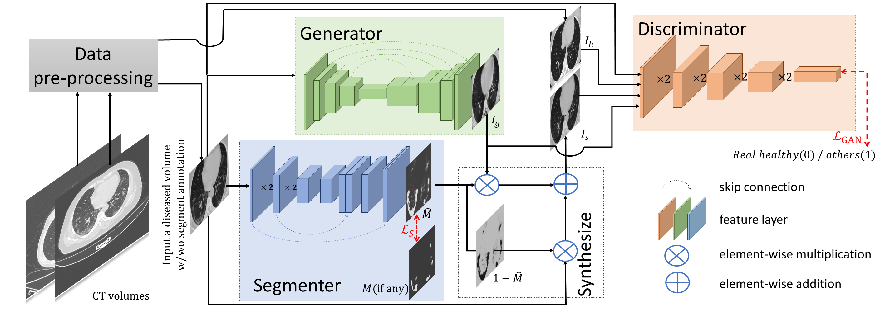

# GASNet
This is a PyTorch implementation of GASNet for leison segmentation of COVID-19 in a weakly-supervised scenario.

## Architecture

Three modules with optimizable parameters compose the framework of GASNet, the segmenter (S), the generator (G), and the discriminator (D). 
    The segmenter (S) predicts the infected areas given a CT volume. The generator (G) generates
    a new volume. By replacing lesion areas in the original volume by the generated volume,
    a synthesis volume is obtained. 
    The synthetic volumes and the real healthy volumes are input into a discriminator (D) for classification. The parameters of the G and the S are
      optimized to make the synthetic volume look as similar as possible to a real healthy volume, so that the discriminator can not distinguish. 
      Original COVID-19 volume and the generated volume are also fed into the D as auxiliary constraints. 
      Only the S part is needed during the test, 
      which means GASNet has no extra computational 
      burden compared with the standard segmentation network. 

## Prerequisites
- python 3.7
- pytorch 1.2.0
- torchvision 0.4.0
- numpy, skimage, scipy, SimpleITK, and imgaug

## Usage 
### data-preprocessing 
Your need do some data-preprocessing work before use the data to train GASNet. An open-soure lung segmentation mask is available at <https://github.com/JoHof/lungmask> so you can get the bound box around the lung area. The 3D volume sample of each CT, along with the lung mask and lesion segmentation label (if any),
is cropped along the lung mask. The cropped CT volume is then
resized into 40×160×160, and its value is clipped into [-1250,250]. 


To run the code both in training and testing, three dirs are needed, including ./images to restore CT volumes, ./lung to restore lung segmentation results, and ./lesion to restore lesion labels. Change the root path of the dataset in ./configs/Gan.yaml to your dataset path and modify the splition configuration according to your needs. 

### training
Simply run 
```
sh train.sh
```
to train GASNet. To add or delete the constraint losses metioned in the paper, you can change the prefix of EXP.ID in the configure file.

### testing
Simply change the path to your trained model and run 
```
sh test.sh
```
to test the performance of GASNet. 
## Visualization of segmentation results


## Contact
Never mind open issues about the code or data. If you have any further questions about GASNet, please contact me <xzw14@tsinghua.org.cn>

